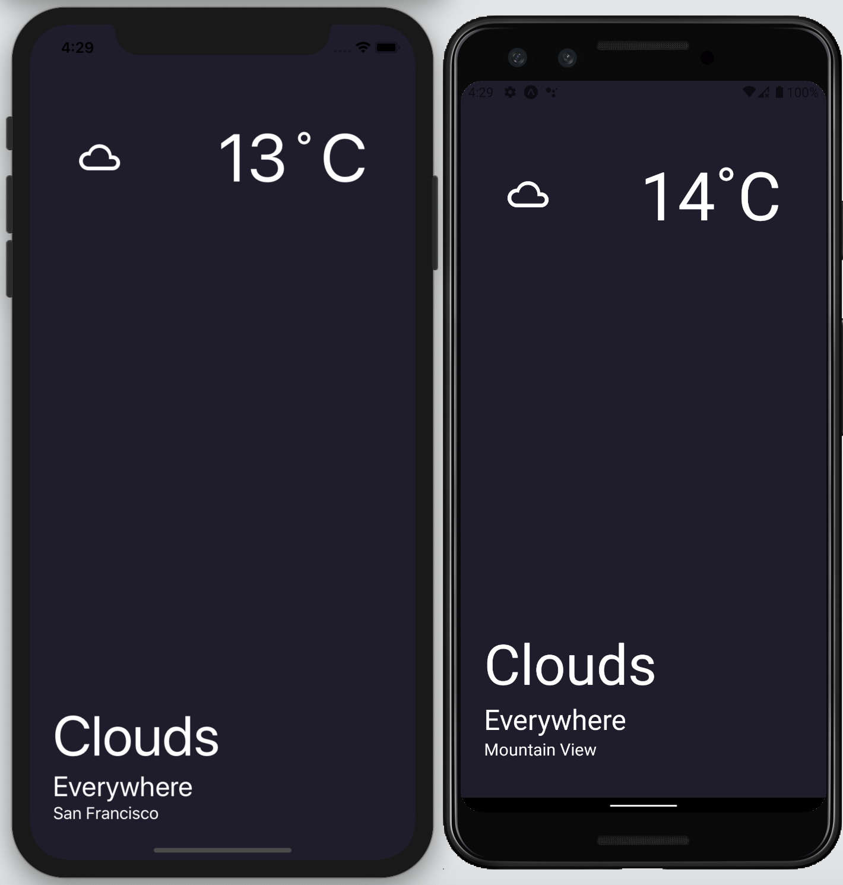

# The Weather App



This project was bootstrapped with [Expo](https://expo.io/).

## How to use it?

### Download manually

Install:

```bash
npm install
# or
yarn install
```

Run:

```bash
npm run start
# or
yarn start
```

Opening an iOS simulator:

```bash
npm run ios
# or
yarn ios
```

Opening an Android simulator:

```bash
npm run android
# or
yarn android
```

Opening a browser:

```bash
npm run web
# or
yarn web
```

Prettier:
```bash
npm run prettier
# or
yarn prettier
```

Eject:
```bash
npm run eject
# or
yarn eject
```
